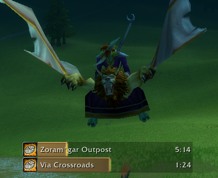

# Flight Timers for Deadly Boss Mods

Hop on a Gryphon, Wyvern or whatever your local flight master offers and this mod will show you a DBM timer for the remaining time.

Currently only supports "standard" flights, no weird Quest-related flights at the moment.
This means that this works best in Classic and WotLK, Retail players may want to prefer [InFlight Taxi Timer](https://www.curseforge.com/wow/addons/inflight-taxi-timer) for a more complete coverage.

## Features

* Timers for all flight paths in Classic and for most flights in Classic-WotLK and Retail
* Timers for intermediate stops
* Updates timer if you request an early stop
* Independent of client locale, works with all languages

## FAQ

### The timer for my flight was wrong, can you fix it?
We currently just take the timers from InFlight that [are crowdsourced on WoWInterface](https://www.wowinterface.com/forums/showthread.php?t=18997&page=27), we currently do not maintain our own database for flights.

## TODO List

* Learn times of unknown or inaccurate flight paths
* Come up with some way for users to contribute these timers
